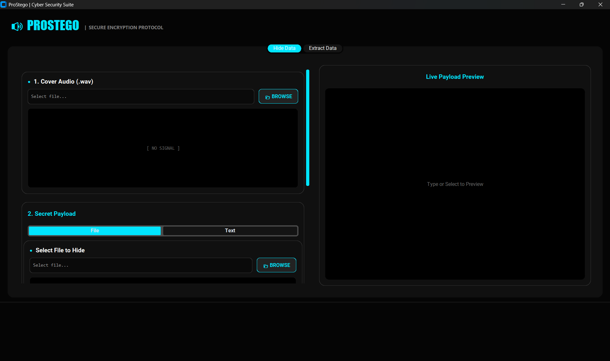

# 🔊 Professional Audio Steganography Tool (ProStego)


## 📸 Screenshot



*A modern desktop application with an intuitive interface for hiding and extracting data from audio files.*

---

## ✨ Features

- 🎵 **Audio Steganography**: Hide files and text inside WAV audio files using the LSB (Least Significant Bit) technique.
- 🔐 **Secure Encryption**: AES-256 encryption with PBKDF2 key derivation and password protection.
- 📦 **Data Compression**: Automatic compression using zlib to maximize storage capacity.
- 🎨 **Modern GUI**: A beautiful, user-friendly interface built with CustomTkinter.
- 👁️ **Real-time Preview**: View audio waveforms, images, and text before hiding or extracting.
- 🎶 **Audio Player**: A built-in player to preview audio files with play/stop controls.
- 📄 **Multi-format Support**: Hide any file type (PDF, images, text, documents, etc.).
- ⚙️ **Progress Tracking**: Real-time progress bar and logging console.
- 🌙 **Dark Theme**: Modern dark mode interface for comfortable viewing.
- ✅ **Data Validation**: Ensures data integrity and safety.

---

## 🔧 How It Works

### LSB (Least Significant Bit) Steganography

The application uses LSB stganography to hide data imperceptibly within audio files. Each audio sample's least significant bit is modified to store data bits. This creates minimal audio degradation while allowing for large data storage.

```

Original byte:   10110101
After hiding:    10110100   (LSB changed from 1 to 0)
Audio quality:   Imperceptible to the human ear ✓

```

### Data Flow

**Hiding Process:**
```

Secret Data → Compress → Encrypt → Add Header → Insert into Audio (LSB) → Output File

```

**Extraction Process:**
```

Stego Audio → Extract LSB Bits → Remove Header → Decrypt → Decompress → Recover Data

```

### Custom Metadata Header

The header structure stores essential information for data recovery:

| Field         | Size (bytes) | Purpose                       | Example                 |
|---------------|--------------|-------------------------------|-------------------------|
| Flags         | 1            | Compression & Encryption status | `0x03` (both enabled)   |
| Filename      | 255          | Original filename             | `document.pdf`          |
| Original Size | 4            | Uncompressed data size        | `1048576`               |

### Professional Encryption Pipeline

The encryption system has been upgraded to use `PyCryptodome` with **AES-256-GCM**, a mode that provides authenticated encryption and is highly efficient for large files.

**Encryption Flow:**
`Password → [PBKDF2 with Salt & 100,000 Iterations] → Strong Key → [AES-GCM Encryption] → Structured Encrypted File`

**Resulting Encrypted File Structure:**
`[Magic Bytes] + [Salt] + [Nonce] + [Ciphertext] + [Authentication Tag]`

-   **Streaming:** The file is encrypted in chunks instead of being loaded entirely into memory, allowing for the processing of huge files.
-   **Magic Bytes:** An identifier at the start of the file to verify it was encrypted by our application.
-   **Authentication Tag:** A security seal at the end of the file. If even a single bit of the data is altered, this tag verification will fail, and we immediately know the data is corrupt.

---

## 🛠️ Technologies & Libraries

| Technology      | Version  | Purpose                                                              |
| --------------- | ---------- | -------------------------------------------------------------------- |
| **Python** | 3.8+       | The core programming language of the project.                        |
| **CustomTkinter** | 5.2.2      | For building the modern and attractive GUI.                          |
| **PyCryptodome**| 3.19.0     | Provides professional AES-GCM encryption and large file handling.    |
| **pydub** | 0.25.1     | For processing and reading various audio file formats.               |
| **Matplotlib** | 3.8.0      | For plotting and rendering audio waveforms.                          |
| **simpleaudio** | 1.0.4      | For playing audio clips directly from within the application.        |
| **Pillow** | 10.1.0     | For processing and displaying images in the preview pane.              |
| **FFmpeg** | external   | A crucial tool required by pydub to process MP3 files.               |

---

## 📦 Installation

### System Requirements

- **Python**: 3.8 or higher
- **OS**: Windows, macOS, or Linux
- **RAM**: Minimum 2GB (4GB recommended)
- **Storage**: 500MB free space for dependencies

### Step-by-Step Setup

#### 1. Clone the Repository
```bash
git clone [https://github.com/omar52478/Professional-Audio-Steganography.git](https://github.com/omar52478/Professional-Audio-Steganography.git)
cd Professional-Audio-Steganography
````

#### 2\. Create and Activate a Virtual Environment

**Windows (PowerShell):**

```powershell
python -m venv venv
.\venv\Scripts\Activate.ps1
```

**Linux/macOS:**

```bash
python3 -m venv venv
source venv/bin/activate
```

#### 3\. Install Dependencies

```bash
pip install -r requirements.txt
```

#### 4\. Run the Application

```bash
python main.py
```

-----

## 🚀 Usage Guide

### Hiding Data

1.  **Select Cover Audio**: Click "Browse" to choose a `.WAV` audio file.
2.  **Choose Secret Data**:
      - Select the "File" tab to hide any file type.
      - Or select the "Text" tab to hide plain text.
3.  **Configure Options**:
      - Set an optional password for encryption.
      - Check "Compress data" for better capacity (recommended).
4.  **Hide Data**: Click "Start Hiding" and choose an output location.
5.  **Success**: Your stego audio file is ready to share\!

### Extracting Data

1.  **Select Stego Audio**: Choose the audio file containing the hidden data.
2.  **Enter Password**: If encryption was used, enter the correct password.
3.  **Extract & Preview**: Click the "Extract" button to process the file and preview the data.
4.  **Save Data**: Click "Save to Disk" to save the recovered file.

-----

## 📁 Project Structure

```
ProStegoApp/
├── main.py                # Main GUI application entry point
├── logic.py               # LSB hiding and extraction core logic
├── security.py            # Encryption/decryption functions
├── requirements.txt       # Python dependencies
├── README.md              # This file
│
├── ui/
│   ├── __init__.py
│   └── widgets.py         # Custom GUI components
│
└── utils/
    ├── __init__.py
    ├── audio_player.py    # Audio playback functionality
    └── preview_handler.py # File preview generators (waveform, images, text)
```

-----

## ⚙️ Advanced Features

### Capacity Calculation

The maximum data capacity depends on the audio file size and parameters.

  - **Capacity Formula**: `Audio file size (bytes) / 8`
  - **Example**: A 10MB WAV file can hide approximately 1.25MB of data. Compression can significantly increase this capacity depending on the data type.

### Security Best Practices

**✅ Do:**

  - Use strong, unique passwords (12+ characters with mixed case, numbers, and symbols).
  - Store stego files in a safe and secure location.
  - Verify file integrity before and after the process.
  - Keep backup copies of the original audio file.

**❌ Don't:**

  - Use weak or easily guessable passwords.
  - Share stego files on untrusted platforms without protection.
  - Delete the original audio file immediately after hiding data.
  - Ignore any error messages during the process.

### Supported File Types

**For Hiding:**

  - **Documents**: PDF, DOCX, TXT, etc.
  - **Images**: PNG, JPG, GIF, BMP
  - **Any other binary file type**.

**Cover Audio:**

  - **WAV files** are primarily supported for the best results.
  - Higher quality audio (higher sample rate and bit depth) provides more capacity.

-----

## 🐛 Troubleshooting

### Issue: "Cover audio is too small to hide this data"

**Solution**: Use a larger audio file or ensure the "Compress data" option is enabled.

### Issue: "Decryption failed - Incorrect password"

**Solution**: Verify that the password is correct, paying attention to case sensitivity.

### Issue: Audio playback not working or "pydub" errors

**Solution**: This is often due to a missing FFmpeg installation. Install it on your system:

  - **Windows**: `choco install ffmpeg`
  - **macOS**: `brew install ffmpeg`
  - **Linux**: `sudo apt-get install ffmpeg`

-----

## 🤝 Contributing

Contributions are welcome\! To contribute:

1.  Fork the repository.
2.  Create a feature branch (`git checkout -b feature/amazing-feature`).
3.  Commit your changes (`git commit -m 'Add amazing feature'`).
4.  Push to the branch (`git push origin feature/amazing-feature`).
5.  Open a Pull Request.

### Code Style

  - Follow PEP 8 conventions.
  - Use meaningful variable and function names.
  - Add comments for complex or non-obvious logic.
  - Test thoroughly before submitting a pull request.

-----

## 👨‍💻 Author

**Omar Ahmed** (@omar52478)

  - **GitHub**: [omar52478](https://github.com/omar52478)
  - **Project Repository**: [Professional-Audio-Steganography](https://github.com/omar52478/Professional-Audio-Steganography)

-----

## 🌟 Acknowledgments

  - **CustomTkinter**: For the modern GUI framework.
  - **pydub**: For simplifying audio file processing.
  - **cryptography**: For the robust and secure encryption library.
  - All community members for their feedback and contributions.

-----

## 📚 Learn More

  - [Steganography on Wikipedia](https://en.wikipedia.org/wiki/Steganography)
  - [Cryptography Basics](https://en.wikipedia.org/wiki/Cryptography)
  - [Python Documentation](https://docs.python.org/3/)

-----

**Made with ❤️ for secure data hiding and audio steganography enthusiasts.**

```
```